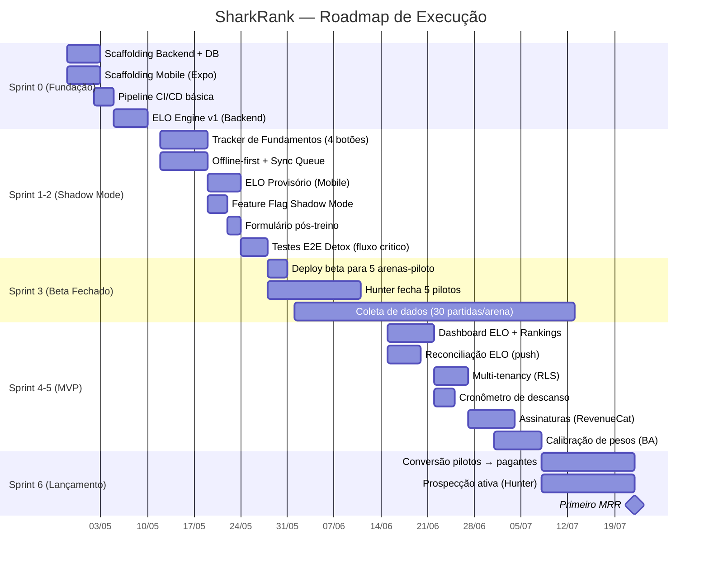
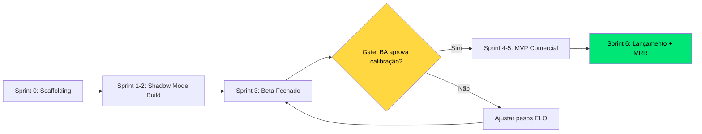

# 🦈 SharkRank — Plano de Execução (Implementation Plan)

**Objetivo:** Sair do PRD v2.0 e chegar ao primeiro MRR de R$ 5k em ~14 semanas.
**Estratégia:** Shadow Mode (calibração) → MVP (lançamento) → Conversão (receita).

---

## 📅 Visão Macro (14 Semanas)

---

## 🏗️ Sprint 0 — Fundação Técnica (Semana 1-2)

> **Objetivo:** Zero funcionalidades visíveis. Toda a infraestrutura que permite velocidade depois.

### Backend (Python + FastAPI)
| # | Tarefa | Owner | Critério de Aceite |
|---|--------|-------|--------------------|
| B1 | Scaffolding FastAPI + estrutura de pastas | Backend | `GET /health` retorna 200 |
| B2 | PostgreSQL + Alembic migrations | Backend | Schema `arenas`, `players`, `matches`, `elo_history` criado |
| B3 | Row-Level Security (RLS) habilitado | Backend | Query sem `arena_id` retorna 0 rows |
| B4 | Endpoint idempotente `POST /matches` | Backend | Requisição duplicada retorna 200 sem reprocessar |
| B5 | Motor ELO completo (K-factor dinâmico) | Backend | Teste unitário com 100 partidas sintéticas passa |
| B6 | `elo_config_v1.json` publicado | Backend | Mobile consegue baixar config via `GET /elo/config` |
| B7 | Worker Celery para recálculo de ranking | Backend | Ranking da arena recalcula em <2s para 50 jogadores |

### Mobile (React Native + Expo)
| # | Tarefa | Owner | Critério de Aceite |
|---|--------|-------|--------------------|
| M1 | `npx create-expo-app` + estrutura de pastas | Mobile | App roda no Expo Go (iOS + Android) |
| M2 | WatermelonDB configurado | Mobile | CRUD local funciona offline |
| M3 | Navegação (React Navigation) | Mobile | 4 tabs: Tracker, Dashboard, Ranking, Config |
| M4 | Design System (cores WCAG AAA, tipografia) | Mobile | Componentes `Button`, `Card`, `SkillBar` criados |
| M5 | Sync Queue (background upload) | Mobile | Dados sincronizam quando conexão é restaurada |

### QA/Infra
| # | Tarefa | Owner | Critério de Aceite |
|---|--------|-------|--------------------|
| Q1 | GitHub Actions: lint + unit tests (backend) | QA | Pipeline roda em <3 min a cada push |
| Q2 | GitHub Actions: EAS Build (mobile) | QA | APK/IPA gerado automaticamente |
| Q3 | Teste de contrato ELO (simplificado vs. completo) | QA | Divergência ≤5pts em 95% dos casos |

---

## ⚡ Sprint 1-2 — Shadow Mode Build (Semana 3-4)

> **Objetivo:** App funcional para os pilotos. Tracker + Offline + Shadow Mode.

| # | Tarefa | Owner | Critério de Aceite |
|---|--------|-------|--------------------|
| S1 | Tela de Tracker com 4 botões fat-finger (2×2, 72dp) | Mobile | `testID` sr_btn_* presentes, funciona iPhone SE→iPad |
| S2 | Lógica de marcação: tocar botão → evento registrado com timestamp | Mobile | WatermelonDB persiste evento offline |
| S3 | Tela de placar com contagem automática de sets (primeiro a 18) | Mobile | Set finaliza automaticamente em 18 pontos |
| S4 | ELO provisório local (`elo_config_v1.json`) | Mobile | ELO aparece com badge "✓ Provisório" ao finalizar |
| S5 | Feature flag `SHADOW_MODE=true` | Mobile | ELO calculado mas NÃO exibido; tela placeholder no ranking |
| S6 | Formulário pós-treino (3 perguntas) | Mobile | Exibido ao finalizar sessão; respostas sincronizadas |
| S7 | Endpoint `POST /matches` com reconciliação | Backend | Push silencioso enviado com delta |
| S8 | Endpoint `/arenas/{id}/calibration-report` | Backend | Retorna ELO vs. percepção para o BA |
| S9 | Automação E2E Detox: fluxo crítico completo | QA | Criar→Marcar 18→Finalizar→Sync passa green |
| S10 | Smoke test de crash rate (Sentry integrado) | QA | <0.5% de sessões com crash |

---

## 🏖️ Sprint 3 — Beta Fechado / Shadow Mode (Semana 5-8)

> **Objetivo:** 5 arenas-piloto usando o app. Coleta de dados reais.

| # | Tarefa | Owner | Critério de Aceite |
|---|--------|-------|--------------------|
| F1 | Hunter fecha 5 arenas-piloto (contrato beta) | Hunter | 5 contratos assinados no CRM como "Piloto Ativo" |
| F2 | Onboarding presencial (instalar app + treinar professor) | Hunter | Professor marca fundamentos sozinho na 2ª sessão |
| F3 | Monitoramento semanal de sessões por arena | Ger. Vendas | Dashboard no CRM: sessões/arena ≥3/semana |
| F4 | Coleta de depoimentos em vídeo | Hunter | ≥3 vídeos de 30-60s gravados |
| F5 | Smoke tests semanais no build de produção | QA | Crash rate <0.5% mantido |
| F6 | Formulários pós-treino respondidos | BA | ≥80% taxa de resposta |
| F7 | Relatório de calibração (ELO vs. percepção) | BA | Produzido após 30 partidas/arena |
| F8 | Ajuste de pesos no `elo_config_v2.json` | Backend+BA | Divergência ELO vs. percepção ≤15% |

> **Gate de saída:** O BA aprova que a divergência ELO vs. percepção é aceitável. SÓ então o MVP é lançado.

---

## 🚀 Sprint 4-5 — MVP Comercial (Semana 9-12)

> **Objetivo:** Produto vendável. Dashboard + Rankings visíveis + Assinaturas.

| # | Tarefa | Owner | Critério de Aceite |
|---|--------|-------|--------------------|
| V1 | Dashboard ELO do atleta (gráficos de evolução) | Mobile | Radar chart + histórico de partidas |
| V2 | Ranking da arena (leaderboard) | Mobile + Backend | Lista ordenada por ELO com tiers visuais |
| V3 | Reconciliação ELO via push silencioso | Mobile + Backend | Delta <3 corrige silenciosamente; >3 notifica |
| V4 | Multi-tenancy completo (arena isolada) | Backend | Professor Arena A não vê dados Arena B |
| V5 | Cronômetro de descanso entre sets | Mobile | Timer configurável com alerta sonoro |
| V6 | Integração RevenueCat (assinaturas) | Mobile | Fluxo de pagamento B2B e B2C funcional |
| V7 | Telas de pricing in-app | Mobile | 3 planos exibidos com feature comparison |
| V8 | `SHADOW_MODE=false` (ELO agora visível) | Mobile + Backend | Ranking e dashboard funcionais |
| V9 | Landing page + onboarding flow | Mobile | Primeira experiência guiada em 3 telas |

---

## 💰 Sprint 6 — Lançamento + Primeiro MRR (Semana 13-14)

> **Objetivo:** Converter pilotos e iniciar prospecção ativa. Meta: R$ 5k MRR.

| # | Tarefa | Owner | Meta |
|---|--------|-------|------|
| L1 | Proposta comercial para 5 arenas-piloto | Ger. Vendas + Hunter | ≥3 convertidas (60%) |
| L2 | Prospecção ativa em novas arenas | Hunter | ≥4 demos/semana |
| L3 | Publicação nas app stores (iOS + Android) | QA | Aprovado na App Store e Play Store |
| L4 | Campanha de prova social (depoimentos) | Ger. Vendas | 3 vídeos publicados no Instagram da marca |
| L5 | Monitoramento de churn e NPS | BA | NPS ≥40 no primeiro mês |

### 💵 Projeção de MRR (Cenário Conservador)

| Mês | Arenas Pagantes | Plano Médio | MRR |
|-----|----------------|-------------|-----|
| Mês 1 (Jul) | 3 (ex-pilotos) | R$ 149 | R$ 447 |
| Mês 2 (Ago) | 8 (+5 novas) | R$ 149 | R$ 1.192 |
| Mês 3 (Set) | 15 (+7 novas) | R$ 149 | R$ 2.235 |
| Mês 4 (Out) | 25 (+10) | R$ 165* | R$ 4.125 |
| Mês 5 (Nov) | 35 (+10) | R$ 175* | R$ 6.125 |
| Mês 6 (Dez) | 45 (+10) | R$ 185* | R$ 8.325 |

*\* Ticket médio sobe com upsell de planos maiores e B2C.*

---

## 🎯 Dependências Críticas

> [!IMPORTANT]
> O **Gate de Calibração** (Sprint 3 → Sprint 4) é o momento mais crítico do projeto. Se o BA detectar que o ELO diverge demais da percepção real, o backend ajusta os pesos e o ciclo de 30 partidas reinicia. O lançamento NÃO acontece sem aprovação.
