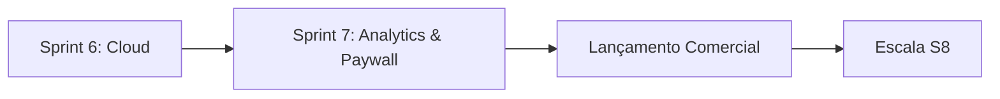

# 🦈 SharkRank — Plano de Execução (Implementation Plan)

**Objetivo:** Sair do PRD v2.0 e chegar ao primeiro MRR de R$ 5k em ~14 semanas.
**Estratégia:** Shadow Mode (calibração) → MVP (lançamento) → Conversão (receita).

---

## ✅ Histórico de Conquistas (Sprints Anteriores)

- **Sprint 0-4:** Fundação, Scaffolding, Mobile V1, Backend Core.
- **Sprint 5: Futevôlei Polishing & ELO V2**
  - Motor de Partida V2 (Sets, Regras de Vantagem, Teto de Pontos).
  - Pesos de fundamentos específicos (Coxa, Peito, Shark Ataque).
  - UI de alta fidelidade (Ocean Dark Theme).
- **Sprint 6: Deployment & Cloud Foundations**
  - Repositório GitHub oficial e versionamento.
  - Configuração EAS/Expo para Builds Android/iOS.
  - Deploy da API e Sincronização Mobile-Cloud.

---

## 📅 Roadmap Futuro (Atualizado)

### 🚀 Sprint 7: "The Business Leap" (EM ANDAMENTO)
**Foco:** Inteligência de Dados e Ativação de Receita.
- **Player Analytics V2:** Heatmaps de fundamentos e Radar Charts de habilidades.
- **Timeline de Partida:** Histórico detalhado de cada ponto e quem marcou.
- **Social Share:** Gerador de imagens para Instagram Stories (Placar + Tier).
- **Shark Pro:** Integração real com RevenueCat para liberar o ranking oficial.

### 🔜 Sprint 8: Escala & Multi-Arena
- **Dashboard Administrativo:** Interface Web para donos de arena gerenciarem mensalidades.
- **Sistema de Torneios:** Chaves automáticas baseadas no ELO dos inscritos.
- **Indique um Atleta:** Sistema de referral para crescimento orgânico (Growth Loop).

### 🔜 Sprint 9: Expansão de Esportes
- Adaptação do motor de ELO para Beach Tennis e Padel.
- Customização de fundamentos por esporte.

---

## 🏗️ Detalhes da Sprint 7 (Semana Atual)

| # | Tarefa | Owner | Critério de Aceite |
|---|--------|-------|--------------------|
| S7.1 | API de Estatísticas Agregadas | Backend | Endpoint `/stats` retorna % de acerto por fundamento |
| S7.2 | Gráfico de Radar no Perfil | Mobile | Habilidades visuais (Defesa, Ataque, Recepção) |
| S7.3 | Timeline da Partida | Mobile | Scrollview com todos os eventos do jogo salvo |
| S7.4 | Integração Paywall RevenueCat | Mobile | Bloqueio de ranking para usuários non-pro |
| S7.5 | Template de Compartilhamento | Designer | Layout .png gerado dinamicamente com dados da partida |

---

## 🎯 Dependências Críticas

> [!IMPORTANT]
> A Sprint 7 é o divisor de águas entre um "utilitário gratuito" e um "SaaS de valor". O foco absoluto é na qualidade visual dos dados (UAU do usuário) para justificar a assinatura Pro.
